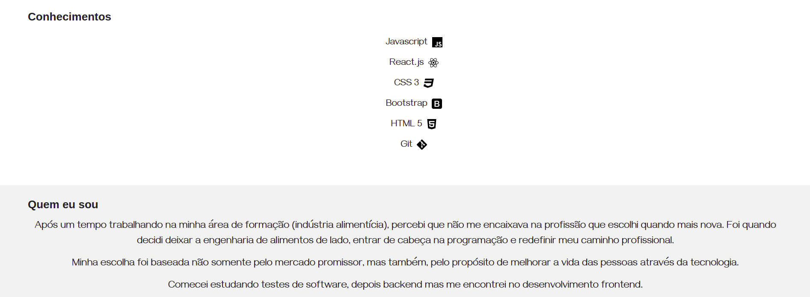

#  Página pessoal - Helena Meyer

## Descrição
O helenameyer.com.br foi idealizado e desenvolvido com o objetivo de mostrar um pouco mais, de forma prática, o que aprendi a fazer ao longo dos meus estudos em programação, onde meu foco principal é desenvolvimento frontend. 

Atualmente a página está desenvolvida utilizando HTML e CSS mas em breve ela será refatorada e demais linguagens e frameworks serão utilizados para um melhor aproveitamento de código e tempo. 

## Índice
- [Requisitos](#Requisitos)
- [Uso](#Uso)
- [Imagens](#Imagens)

## Requisitos
- Siga os passos de instalação abaixo. 

## Uso
- Após clonar o repositório;
- Abra o projeto no VScode;
- Utilize o LiveServer para abrir o projto;

  - O LiveServer é uma extensão que deve ser instalada previamente no seu Vscode;

- Navegue entre as páginas Home, Aplicação e About;

## Imagens

Veja abaixo algumas imagens do projeto

### <b> Home </b>

  

  

  

### <b> Aplicações </b>

  

  

### <b> About </b>

  

  

